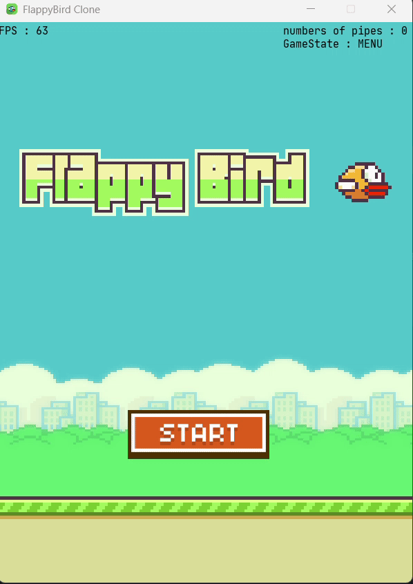

# Flappy Bird - Java Edition

A simple Flappy Bird clone written in Java using `javax.swing` and `java.awt`.  
This project demonstrates basic game programming concepts such as animation, collision detection, and user input handling.

---

## Features

- Classic Flappy Bird gameplay mechanics  
- Simple graphics rendering with Java Swing  
- Keyboard controls (spaceBar to flap)  
- Basic collision detection with pipes and ground  
- Score tracking  
- JSON parsing with Gson for sprite configuration (new)

---

| Game Menu                                             | Gameplay                                             |
|-------------------------------------------------------|------------------------------------------------------|
|  |  |

- [ ] Game Over Screen

---

## How to Run

### Using IntelliJ IDEA

1. Open the project folder in IntelliJ IDEA.
2. Make sure your Project SDK is set to **JDK 21** or higher.
3. Build the project (`Build > Build Project`).
4. Run the main class `flappybird.core.FlappyBird` (right-click > Run).

### Using VS Code

1. Install the **Java Extension Pack**.
2. Ensure your Java version is **JDK 21** or higher (`java -version`).
3. Configure `.vscode/settings.json` if needed:

```json
   {
     "java.project.sourcePaths": ["src/main/java"],
     "java.project.outputPath": "target/classes"
   }
````
4. Reload the workspace and build the project.
5. Run `flappybird.core.FlappyBird` (right-click > Run Java).

### Using Maven (Command Line)

1. Make sure you have **JDK 21** set as your `JAVA_HOME`.
2. Run:

   ```bash
   mvn clean compile
   mvn exec:java -Dexec.mainClass="flappybird.core.FlappyBird"
   ```

> [!NOTE]
> If you are using a Java version **between 14 and 21**, make sure to update your Maven compiler plugin to specify the correct source and target versions in your `pom.xml`. For example:
>
> ```xml
> <build>
>   <plugins>
>     <plugin>
>       <groupId>org.apache.maven.plugins</groupId>
>       <artifactId>maven-compiler-plugin</artifactId>
>       <version>3.13.0</version>
>       <configuration>
>         <source>14</source>
>         <target>14</target>
>       </configuration>
>     </plugin>
>   </plugins>
> </build>
> ```
>
> This ensures your project compiles correctly if your JDK is lower than 21 but at least 14 or higher.

---

## Controls

* **SpaceBar or Left Mouseclick** — Make the bird flap (jump)
* **Escape** — Return to Menu

---

## Dependencies

* Java Standard Edition (JDK 21 or higher)
* [Gson](https://github.com/google/gson) (for JSON parsing, managed by Maven)

---

## License

This project is open source and free to use under the MIT License.

---