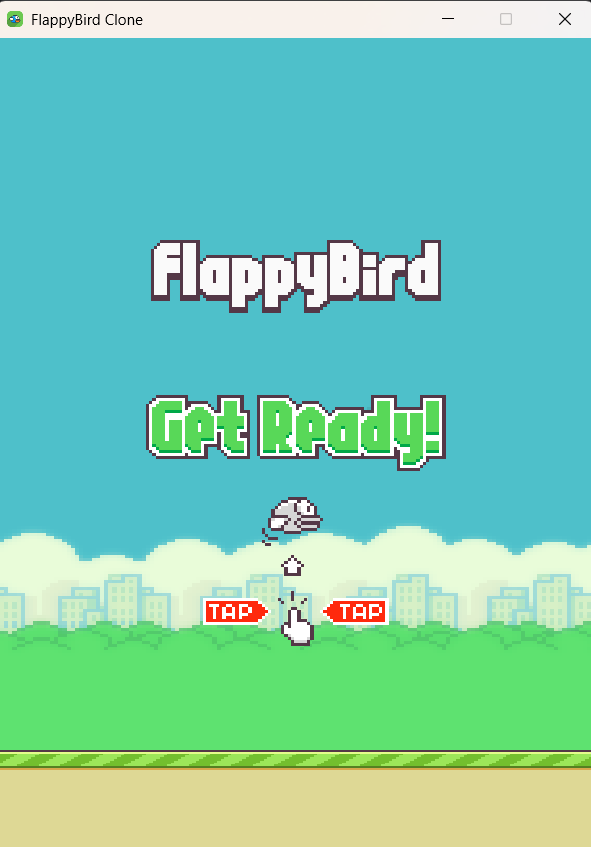
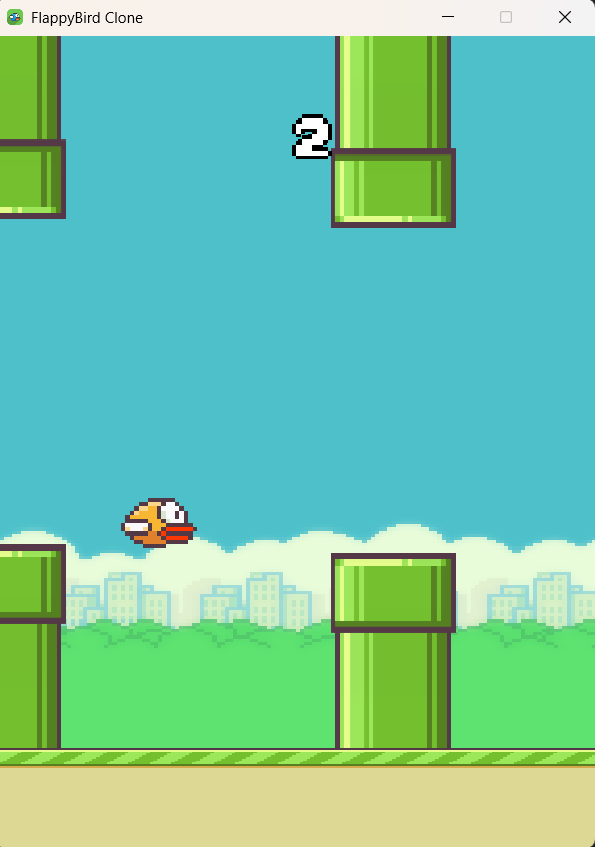

# Flappy Bird - Java Edition

A simple Flappy Bird clone written in Java using `javax.swing` and `java.awt`.  
This project demonstrates basic game programming concepts such as animation, collision detection, and user input handling.

---

## Features

- Classic Flappy Bird gameplay mechanics  
- Simple graphics rendering with Java Swing  
- Keyboard controls (spacebar to flap)  
- Basic collision detection with pipes and ground  
- Score tracking

---

| Game Start                                 | Gameplay                               |
|--------------------------------------------|----------------------------------------|
|  |  |
- [ ] Game Over Screen

---
## How to Run

### Using IntelliJ IDEA

1. Open the project folder in IntelliJ IDEA.
2. Make sure your JDK is configured (Java 8+ recommended).
3. Build the project (`Build > Build Project`).
4. Run `FlappyBird.java` (right-click > Run).

### Using Command Line

1. Compile all `.java` files in the `src` folder:
    ```bash
    javac -d out src/flappybird/*.java
    ```
2. Run the game:
    ```bash
    java -cp out flappybird.FlappyBird
    ```

---


## Controls

- **SpaceBar** — Make the bird flap (jump)

---

## Dependencies

- Java Standard Edition (JDK 8 or higher)  
- No external libraries required

---

## License

This project is open source and free to use under the MIT License.

---

Created by Myson

---
