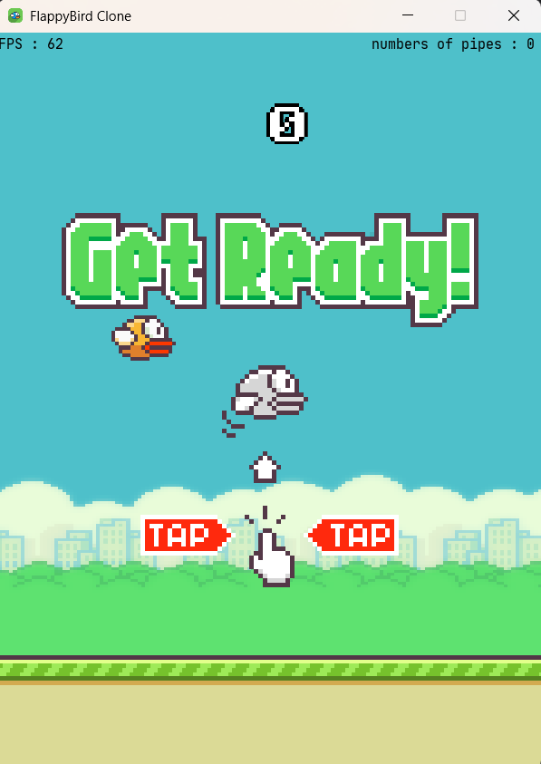

# Flappy Bird - Java Edition

A simple Flappy Bird clone written in Java using `javax.swing` and `java.awt`.  
This project demonstrates basic game programming concepts such as animation, collision detection, and user input handling.

---

## Features

- Classic Flappy Bird gameplay mechanics  
- Simple graphics rendering with Java Swing  
- Keyboard controls (spaceBar to flap)  
- Basic collision detection with pipes and ground  
- Score tracking

---

| Game Start                                 | Gameplay                               |
|--------------------------------------------|----------------------------------------|
|  |  |
- [ ] Game Over Screen
---

## How to Run

### Using IntelliJ IDEA

1. Open the project folder in IntelliJ IDEA.
2. Make sure your JDK is configured (**JDK 14 or higher** required).
3. Build the project (`Build > Build Project`).
4. Run `FlappyBird.java` (right-click > Run).

### Using VS Code

1. Make sure you have the **Java Extension Pack** installed.

2. Ensure you're using **JDK 14 or higher**. You can check this by opening a terminal in VS Code and running:

   ```bash
   java -version
   ```

3. Configure VS Code by adding the following to your `.vscode/settings.json`:

   ```json
   {
     "java.project.sourcePaths": ["src", "res"],
     "java.project.outputPath": "bin"
   }
   ```

4. Open the Command Palette (`Ctrl+Shift+P` or `Cmd+Shift+P`), run **"Java: Clean Java Language Server Workspace"**, and reload the window.

5. Build the project (you may be prompted to do this automatically).

6. Run `FlappyBird.java` (right-click > Run Java).

This setup ensures that both source files and resources (e.g., images in `res/assets`) are compiled and available in the output directory, allowing resource loading via `Class.getResource(...)`.

### Using Command Line

1. Make sure you're using **JDK 14 or higher**:

   ```bash
   java -version
   ```
2. Compile all `.java` files in the `src` folder:

   ```bash
   javac -d out src/flappybird/*.java
   ```
3. Run the game:

   ```bash
   java -cp out flappybird.FlappyBird
   ```

---

## Controls

- **SpaceBar or Left Mouseclick** — Make the bird flap (jump)
- **Escape** — Return to Menu

---

## Dependencies

- Java Standard Edition (JDK 14 or higher)
- No external libraries required

---

## License

This project is open source and free to use under the MIT License.
